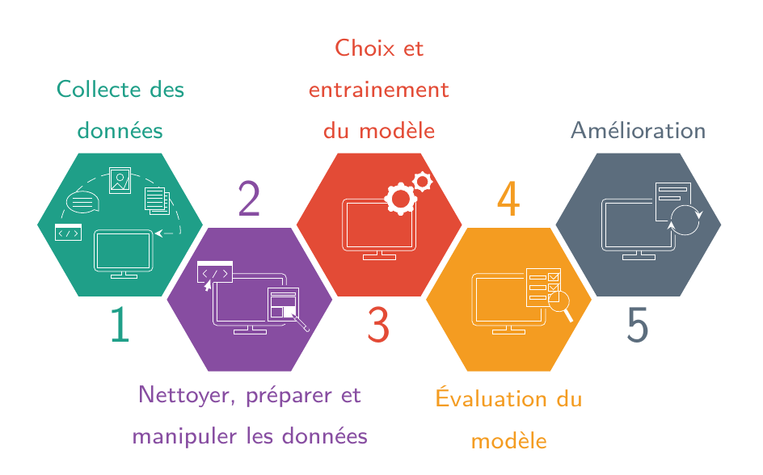

# Supervised Learning Process in Tikz

I wanted to use an image which describes the supervised learning process inside a beamer presentation. One of these images can be found here : https://blog.usejournal.com/machine-learning-for-beginners-from-zero-level-8be5b89bf77c. Unfortunately, it was in English and I would have to manipulate it to hide some sections. This image is inspired by https://cio-wiki.org/wiki/Machine_Learning, Kimberly Cook. Therefore I decided (after a moment of madness) to recreate it in Tikz. And, I thought, I could use it to learn Tikz.

The code is not perfect and the image does not scale well. Maybe I will improve latter. And, note that the texts are in French, but it is easy to change it. Hope you enjoy it !  

## usage

Inside your latex document
```
\usepackage{tikz}
\usepackage{pgfplots}
\usetikzlibrary{shapes.geometric}
\input{slprocess.tikz}

\begin{document}
\resizebox{\textwidth}{!}{
  \begin{tikzpicture}
      \pic {{slprocess}={0 and 0 and 1 and 0 and 0}};
  \end{tikzpicture}
  }
\end{document}
```

## parameters

slprocess image needs 5 binary parameters. Each one control the activation (1) or deactivation (0) of one step. By default (with no parameters), all sections are active. 


